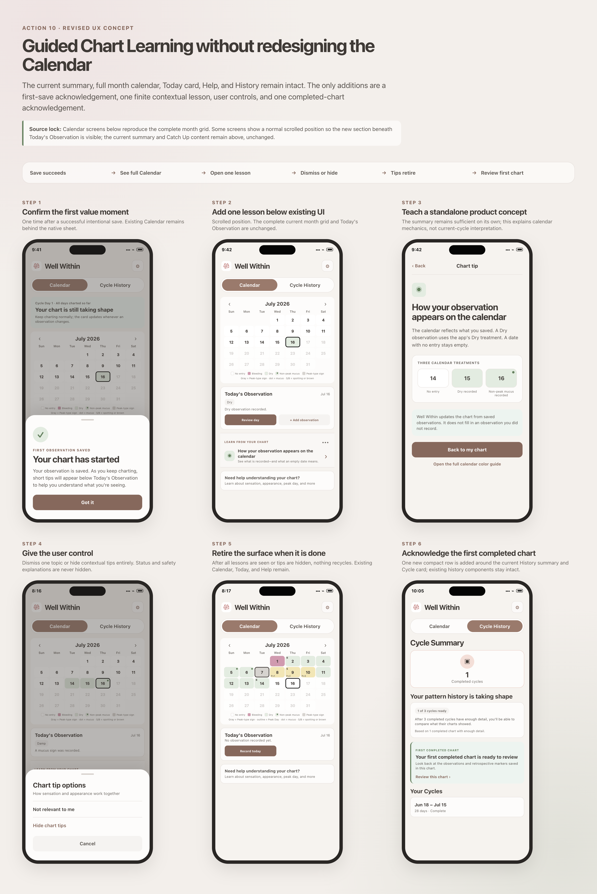
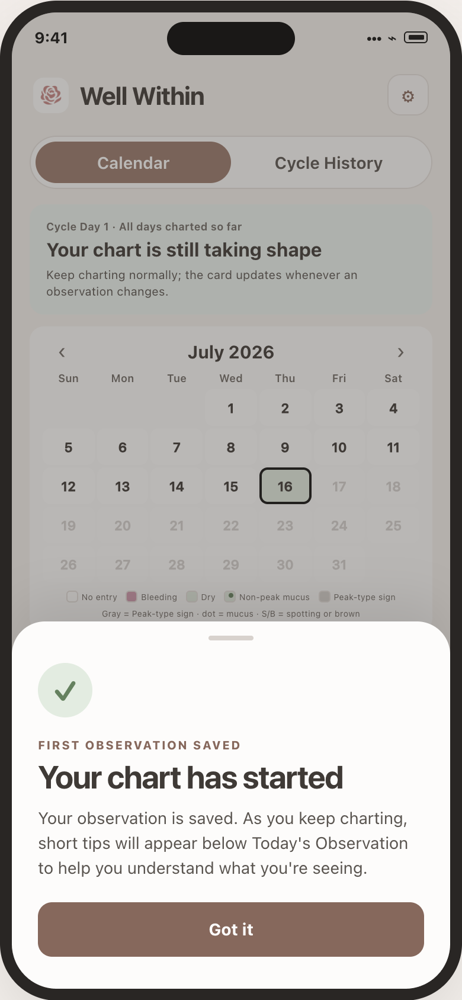
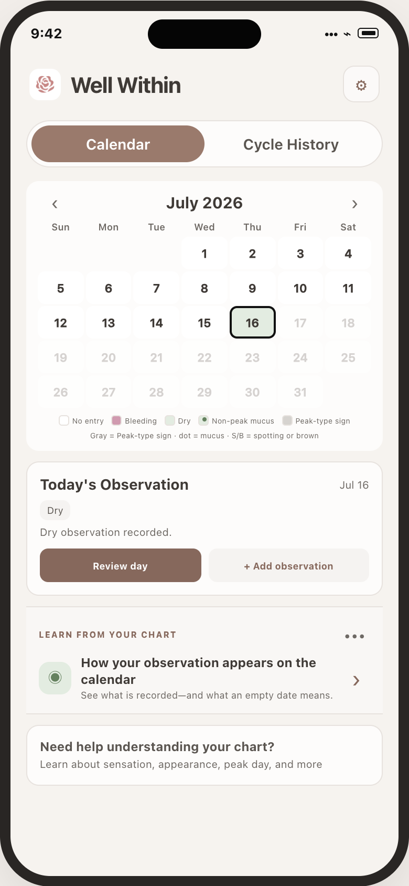
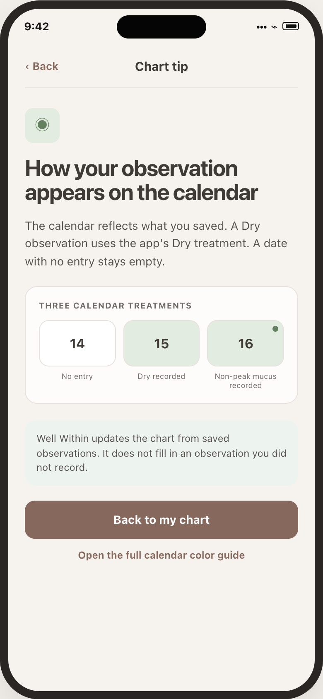
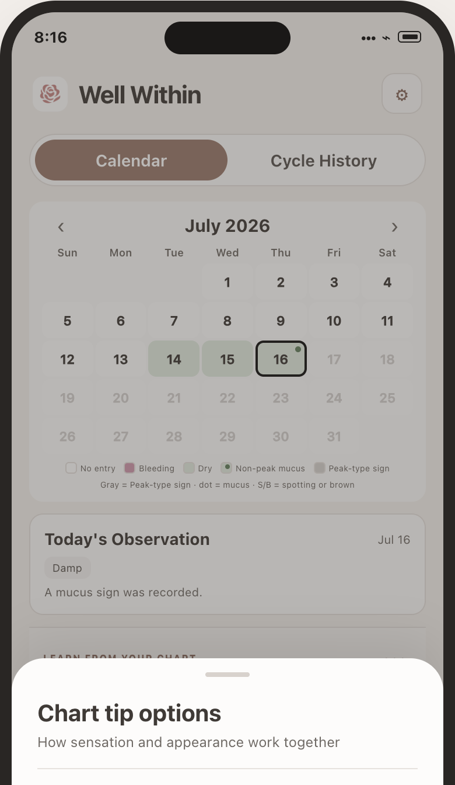
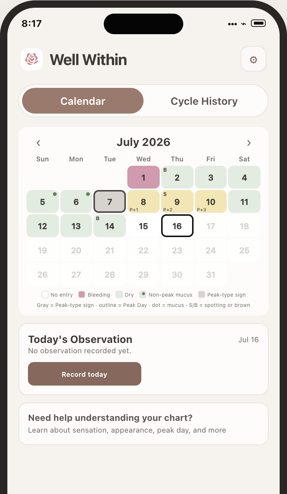
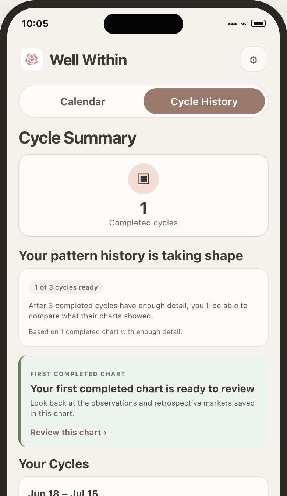

# Guided Chart Learning — Revised User Flow

Date: August 14, 2026

## Visual thesis

The current app is the foundation. The full month Calendar, summary card, Catch Up, feedback link, Today's Observation, Help, History summary, and Cycle cards retain their current structure. New UX is inserted around those components and disappears when it has no remaining value.

Some Calendar mockups show a normal scrolled position so the area below Today's Observation is visible. This does not remove or replace the current summary; it remains above the full Calendar.

## Flow summary

Save succeeds
→ recognize the saved value once
→ see the unchanged full Calendar
→ optionally open one relevant lesson
→ dismiss one topic or hide contextual tips
→ retire the lesson surface when exhausted
→ acknowledge the first completed chart once

## Step 1 — First qualifying save

The existing save completes and the user returns to Calendar before this sheet appears.

- The sheet appears once for the first intentional non-missing save.
- It does not appear for an edit, Not observed, import, restore, or sync arrival.
- Its job is orientation, not navigation: it explains that relevant chart tips appear below Today's Observation.
- Got it, swipe dismissal, and accessibility escape close the sheet in place.
- There is no secondary action because there is no second destination or decision.
- The app does not auto-scroll after dismissal.
- No lesson is required and the entry workflow gains no required tap.
- The complete existing calendar is still present beneath the modal treatment.

## Step 2 — One new section beneath Today's Observation

This is a scrolled Calendar position. It shows the complete current month grid, including navigation, weekday labels, every calendar row, the legend, and its key. The new lesson is placed after the unchanged Today card and before the unchanged Help card.

The first lesson is standalone from the summary:

- summary job: explain what the current chart says, its limitation, and the next action;
- lesson job: explain how a saved observation becomes visible in the Calendar;
- Help job: provide the full reference and a deliberate place to revisit lessons.

If the active summary already explains the same topic, this section chooses a different eligible topic or does not render.

## Step 3 — User-initiated lesson

The user opens a short product-native explanation.

- Target reading time is 30–60 seconds.
- The example uses the exact Calendar treatments already defined by the app.
- Text labels carry meaning in addition to color.
- The lesson explains a durable app mechanic, not a new current-cycle conclusion.
- Back to my chart restores the prior Calendar scroll position.
- The deeper link opens the existing color guide.

## Step 4 — Per-topic and global control

The More action separates two intents:

- Not relevant to me dismisses only the current lesson/version.
- Hide chart tips suppresses future contextual lessons.
- Cancel makes no change.

Hiding chart tips never hides the summary, safety limitations, status explanations, Catch Up, or Help. The user can re-enable contextual tips from Understanding Your Chart > Chart tips.

## Step 5 — Exhausted or hidden state

When all approved lessons have been viewed/dismissed, or the user hides tips:

- the new lesson section disappears;
- lessons do not restart on the next cycle;
- the current full Calendar, Today, and Help remain;
- prior lessons are available for deliberate review in Help.

This is intentional retirement, not an empty-state message. The screen simply returns to the current product.

## Step 6 — First completed chart acknowledgement

Existing History availability triggers a one-time compact acknowledgement.

- Cycle Summary and pattern-history content remain unchanged.
- Existing Cycle cards remain unchanged.
- The acknowledgement routes to the existing completed chart.
- It contains no forecast or new interpretation.
- After view/dismissal, normal History remains.

## Branches

| Situation | Result |
| --- | --- |
| No qualifying save | No new surface |
| User dismisses first-save sheet | Sheet closes in place on Calendar; an eligible lesson may still appear below Today |
| Current summary already owns the topic | Choose another independent lesson or show none |
| User ignores a lesson | Daily charting remains unchanged |
| User dismisses one lesson | Do not immediately replace it; wait for a later meaningful trigger |
| User hides all chart tips | Remove only the contextual lesson section; re-enable from Help |
| All lessons are seen | Remove lesson section; do not repeat each cycle |
| New content version is approved | Resurface only by an explicit product decision, not automatically |
| First completed chart appears | Show one History acknowledgement using existing completion state |

## No rules-engine impact

This flow does not change:

- rank or daily classification;
- current-cycle summary computation or copy selection;
- explanation targets;
- Peak or P+ logic;
- cycle boundaries or completion;
- Calendar colors, markers, rows, legend, or day interaction;
- History comparison logic;
- observation storage, sync, export, or deletion.

The only persistent additions are UI preference IDs/versions for first-save display and optional lesson view/dismiss/hide state.
